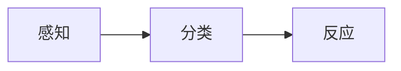
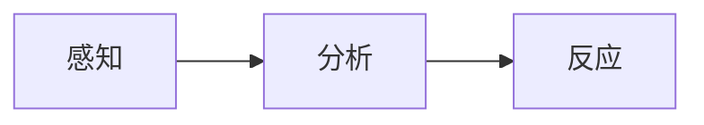
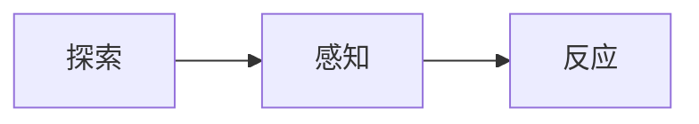
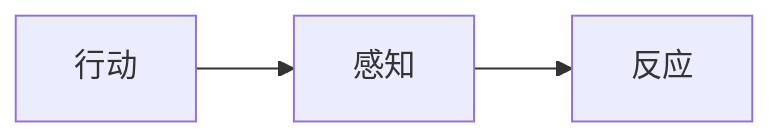

# Cynefin框架
Cynefin模型是用来辅助决策的概念框架

# 5大领域

## 1. Simple / Obvious / Clear
已知的领域，因果关系明确。
行动模式

## 2. Complicated（繁杂)
知道未知的领域；因果关系需要分析。解决问题的正确答案在一个范围内。比如JVM调优这类，需要调优专家来分析给出答案。

行动模式

## 3. Complex（复杂)
不知道未知的领域；因果关系需要反馈推导。解决问题的正确答案还不明确，或者不存在正确答案。

行动模式

## 4. Chaotic（混乱)
因果关系不明，太费解而不能用积累的经验/知识来做出反应。
行动模式

用行动建立秩序，感知稳定的来源，从而把混乱问题转化为复杂/繁杂问题。
## 5. 无序(Disorder)

