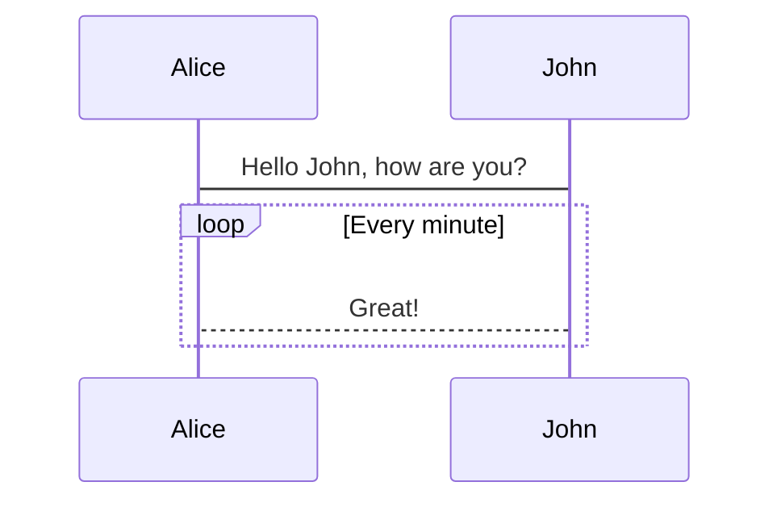
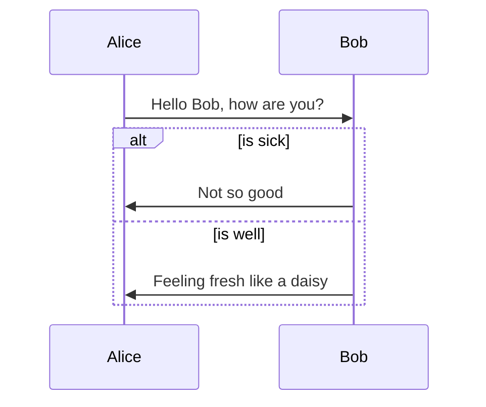
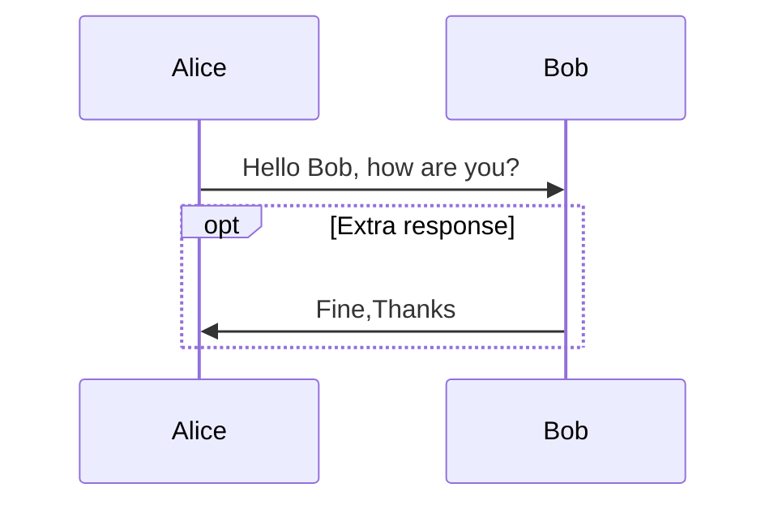
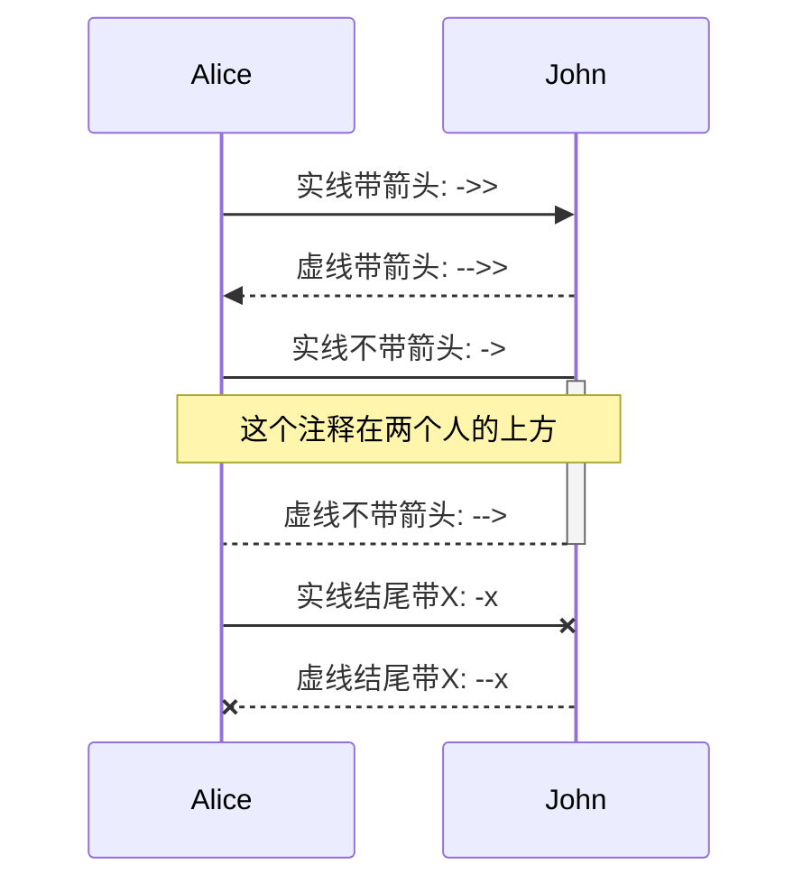

# 流程图

## 1.图的方向
```
graph LR

TB - 从上到下(top buttom)
BT - 从下到上(buttom top)
LR - 从左到右(left right)
RL - 从右到左(right left)
TD - 跟 TB 相同
```
## 2. 三种线类型
```
--- : 实线
-.- : 虚线
=== : 粗线
```
注：
- 虚线带箭头的话加 `>`，实线和粗线则最后一个字符替换成 `>`
- 注释的两种写法(中间加注释，后边加注释)

```
-- 中间加注释写法 -->
-->|后边加注释写法|
```

## 3. 文本框类型
```
[] - 方形文本框
{} - 菱形文本框
() - 边角圆滑文本框
(()) - 圆形文本框
```
## 4.子图
```
 subgraph 子图标题
    子图开始 --> 子图结束
  end
```

## 5.例子
开头以 graph 声明，流程图的语法如下：
```
graph LR
  单独节点
  开始 -- 带注释写法1 --> 结束
  开始 -->|带注释写法2| 结束
  实线开始 --- 实线结束
  实线开始 --> 实线结束
  实线开始 -->|带注释| 实线结束
  虚线开始 -.- 虚线结束
  虚线开始 -.-> 虚线结束
  虚线开始 -.->|带注释| 虚线结束
  粗线开始 === 粗线结束
  粗线开始 ==> 粗线结束
  粗线开始 ==>|带注释| 粗线结束
  subgraph 子图标题
    子图开始 --> 子图结束
  end
  节点1[方形文本框] --> 节点2{菱形文本框}
  节点3(括号文本框) --> 节点4((圆形文本框))
  ```
  效果如下
```mermaid
graph LR
  单独节点
  开始 -- 带注释写法1 --> 结束
  开始 -->|带注释写法2| 结束
  实线开始 --- 实线结束
  实线开始 --> 实线结束
  实线开始 -->|带注释| 实线结束
  虚线开始 -.- 虚线结束
  虚线开始 -.-> 虚线结束
  虚线开始 -.->|带注释| 虚线结束
  粗线开始 === 粗线结束
  粗线开始 ==> 粗线结束
  粗线开始 ==>|带注释| 粗线结束
  subgraph 子图标题
    子图开始 --> 子图结束
  end
  节点1[方形文本框] --> 节点2{菱形文本框}
  节点3(括号文本框) --> 节点4((圆形文本框))
  ```
# 时序图
## 1. 参与者（participant）
注：声明的顺序与画图的顺序一致
```
participant 名称1
participant 名称2
participant A as Alice  : 通过 as 定义别名，后续使用 A 比较方便
```
## 2. 激活参与者

- 可以通过在 > 后面使用 +/- 符号表示激活和去激活，例如：
```
Alice->>+John: Hello John, how are you?
```
- 常规写法
```
activate John    : 激活参与者
deactivate John  : 去激活参与者
```
## 3. 注释
```
Note [ right of | left of | over ] [Actor]: Text in note content

注: Actor 可以是多个，通过逗号分割，例如：

Note over Alice,John: A typical interaction
```
## 4.循环
- 语法
```
loop 描述文本
... 时序图语句 ...
end
```
- 循环例子
```
sequenceDiagram
    Alice->John: Hello John, how are you?
    loop Every minute
        John-->Alice: Great!
    end
```
效果

## 5. 条件时序
- 语法
```
alt 描述文本
... statements ...
else
... statements ...
end
```

- 条件例子
```
sequenceDiagram
    Alice->>Bob: Hello Bob, how are you?
    alt is sick
        Bob->>Alice: Not so good
    else is well
        Bob->>Alice: Feeling fresh like a daisy
    end
```
效果


## 6. 可选时序
- 语法
```
opt 描述文本
... statements ...
end
```
- 时序例子
```
sequenceDiagram
    Alice->>Bob: Hello Bob, how are you?
    opt Extra response
        Bob->>Alice: Fine,Thanks
    end
```
效果


## 7. 例子
时序图以 `sequenceDiagram` 开头声明，语法如下所示
```
sequenceDiagram
    participant Alice
    participant John
    Alice ->> John:  实线带箭头: ->>
    John -->> Alice: 虚线带箭头: -->>
    Alice -> John : 实线不带箭头: ->
    activate John
    Note over Alice,John: 这个注释在两个人的上方
    John --> Alice : 虚线不带箭头: -->
    deactivate John
    Alice -x John : 实线结尾带X: -x
    John --x Alice : 虚线结尾带X: --x
```
效果如下：


# 甘特图
甘特图以 gantt 开头，用 section划分任务集，语法如下：
```
gantt
    title 甘特图的标题
    dateFormat  YYYY-MM-DD
    section Section
    A task           :a1, 2014-01-01, 30d
    Another task     :after a1  , 20d
    section Another
    Task in sec      :2014-01-12  , 12d
    another task      : 24d
```
例子：
```
gantt
       dateFormat  YYYY-MM-DD
       title Adding GANTT diagram functionality to mermaid

       section A section
       Completed task            :done,    des1, 2014-01-06,2014-01-08
       Active task               :active,  des2, 2014-01-09, 1d
       Future task               :         des3, after des2, 1d
       Future task2              :         des4, after des3, 1d

       section Critical tasks
       Completed task in the critical line :crit, done, 2014-01-06,24h
       Implement parser and jison          :crit, done, after des1, 1d
       Create tests for parser             :crit, active, 1d
       Future task in critical line        :crit, 10h
       Create tests for renderer           :1d
       Add to mermaid                      :1d

       section Documentation
       Describe gantt syntax               :active, a1, after des1, 1d
       Add gantt diagram to demo page      :after a1  , 20h
       Add another diagram to demo page    :doc1, after a1  , 8h

       section Last section
       Describe gantt syntax               :after doc1, 30h
       Add gantt diagram to demo page      :20h
```
效果  
```mermaid
gantt
       dateFormat  YYYY-MM-DD
       title Adding GANTT diagram functionality to mermaid

       section A section
       Completed task            :done,    des1, 2014-01-06,2014-01-08
       Active task               :active,  des2, 2014-01-09, 1d
       Future task               :         des3, after des2, 1d
       Future task2              :         des4, after des3, 1d

       section Critical tasks
       Completed task in the critical line :crit, done, 2014-01-06,24h
       Implement parser and jison          :crit, done, after des1, 1d
       Create tests for parser             :crit, active, 1d
       Future task in critical line        :crit, 10h
       Create tests for renderer           :1d
       Add to mermaid                      :1d

       section Documentation
       Describe gantt syntax               :active, a1, after des1, 1d
       Add gantt diagram to demo page      :after a1  , 20h
       Add another diagram to demo page    :doc1, after a1  , 8h

       section Last section
       Describe gantt syntax               :after doc1, 30h
       Add gantt diagram to demo page      :20h
   ```
