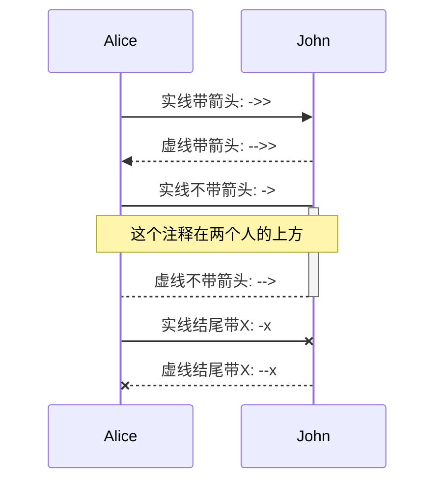

# 流程图

## 1.图的方向
```
graph LR

TB - 从上到下(top buttom)
BT - 从下到上(buttom top)
LR - 从左到右(left right)
RL - 从右到左(right left)
TD - 跟 TB 相同
```
## 2. 三种线类型
```
--- : 实线
-.- : 虚线
=== : 粗线
```
注：
- 虚线带箭头的话加 `>`，实线和粗线则最后一个字符替换成 `>`
- 注释的两种写法(中间加注释，后边加注释)

```
-- 中间加注释写法 -->
-->|后边加注释写法|
```

## 3. 文本框类型
```
[] - 方形文本框
{} - 菱形文本框
() - 边角圆滑文本框
(()) - 圆形文本框
```
## 4.子图
```
 subgraph 子图标题
    子图开始 --> 子图结束
  end
```

## 5.例子
开头以 graph 声明，流程图的语法如下：
```
graph LR
  单独节点
  开始 -- 带注释写法1 --> 结束
  开始 -->|带注释写法2| 结束
  实线开始 --- 实线结束
  实线开始 --> 实线结束
  实线开始 -->|带注释| 实线结束
  虚线开始 -.- 虚线结束
  虚线开始 -.-> 虚线结束
  虚线开始 -.->|带注释| 虚线结束
  粗线开始 === 粗线结束
  粗线开始 ==> 粗线结束
  粗线开始 ==>|带注释| 粗线结束
  subgraph 子图标题
    子图开始 --> 子图结束
  end
  节点1[方形文本框] --> 节点2{菱形文本框}
  节点3(括号文本框) --> 节点4((圆形文本框))
  ```
  效果如下
```mermaid
graph LR
  单独节点
  开始 -- 带注释写法1 --> 结束
  开始 -->|带注释写法2| 结束
  实线开始 --- 实线结束
  实线开始 --> 实线结束
  实线开始 -->|带注释| 实线结束
  虚线开始 -.- 虚线结束
  虚线开始 -.-> 虚线结束
  虚线开始 -.->|带注释| 虚线结束
  粗线开始 === 粗线结束
  粗线开始 ==> 粗线结束
  粗线开始 ==>|带注释| 粗线结束
  subgraph 子图标题
    子图开始 --> 子图结束
  end
  节点1[方形文本框] --> 节点2{菱形文本框}
  节点3(括号文本框) --> 节点4((圆形文本框))
  ```
# 时序图
## 1. 参与者（participant）
注：声明的顺序与画图的顺序一致
```
participant 名称1
participant 名称2
participant A as Alice  : 通过 as 定义别名，后续使用 A 比较方便
```

## 例子
时序图以 `sequenceDiagram` 开头声明，语法如下所示
```
sequenceDiagram
    participant Alice
    participant John
    Alice ->> John:  实线带箭头: ->>
    John -->> Alice: 虚线带箭头: -->>
    Alice -> John : 实线不带箭头: ->
    activate John
    Note over Alice,John: 这个注释在两个人的上方
    John --> Alice : 虚线不带箭头: -->
    deactivate John
    Alice -x John : 实线结尾带X: -x
    John --x Alice : 虚线结尾带X: --x
```
效果如下：


